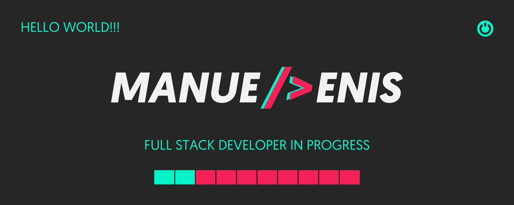

---

| :es: | [Español](README.md) | :uk: | [English](README.md) | :fr: | [Français](README.md) | :portugal: | [Português](README.md) |
| - | - | - | - | - | - | - | - |

---

### :space_invader: &nbsp;Sobre Mi

&nbsp;&nbsp;&nbsp;&nbsp;&nbsp;&nbsp;&nbsp;&nbsp;&nbsp;:man_technologist: &nbsp;Actualmente cursando el Bootcamp Full Stack Developer de CODE SPACE Academy.\
&nbsp;&nbsp;&nbsp;&nbsp;&nbsp;&nbsp;&nbsp;&nbsp;&nbsp;:headphones: &nbsp;Me apasiona la música, los conciertos y los festivales.\
&nbsp;&nbsp;&nbsp;&nbsp;&nbsp;&nbsp;&nbsp;&nbsp;&nbsp;:mountain: &nbsp;Me encanta el senderismo, :runner: salir a correr e :weight_lifting_man: ir el gimnasio.\
&nbsp;&nbsp;&nbsp;&nbsp;&nbsp;&nbsp;&nbsp;&nbsp;&nbsp;:writing_hand: &nbsp;Diseñador Gráfico con mas de 10 años de experiencia y creador de contenidos.\
&nbsp;&nbsp;&nbsp;&nbsp;&nbsp;&nbsp;&nbsp;&nbsp;&nbsp;:briefcase: &nbsp;Empresario en el sector de hosteleria con mas de 15 años de experiencia en el sector.\
&nbsp;&nbsp;&nbsp;&nbsp;&nbsp;&nbsp;&nbsp;&nbsp;&nbsp;:bust_in_silhouette: &nbsp;Vivo en el sur de España.\

---

  &nbsp;&nbsp;&nbsp;&nbsp;
  &nbsp;&nbsp;&nbsp;&nbsp;
  &nbsp;&nbsp;&nbsp;&nbsp;
  &nbsp;&nbsp;&nbsp;&nbsp;
  &nbsp;&nbsp;&nbsp;&nbsp;

---

### :brain: &nbsp;Mis conocimientos (en formación)

---

#### :desktop_computer: &nbsp;Front-End

  </a>&nbsp;&nbsp;&nbsp;&nbsp;
  </a>&nbsp;&nbsp;&nbsp;&nbsp;
  </a>&nbsp;&nbsp;&nbsp;&nbsp;
  </a>&nbsp;&nbsp;&nbsp;&nbsp;

---

#### :keyboard: &nbsp;Programación

  </a>&nbsp;&nbsp;&nbsp;&nbsp;
  </a>&nbsp;&nbsp;&nbsp;&nbsp;
  </a>&nbsp;&nbsp;&nbsp;&nbsp;
  </a>&nbsp;&nbsp;&nbsp;&nbsp;

---

#### :card_index_dividers: &nbsp;Base de Datos

  </a>&nbsp;&nbsp;&nbsp;&nbsp;
  </a>&nbsp;&nbsp;&nbsp;&nbsp;

---

#### :hammer_and_wrench: &nbsp;Frameworks

  </a>&nbsp;&nbsp;&nbsp;&nbsp;
  </a>&nbsp;&nbsp;&nbsp;&nbsp;
  </a>&nbsp;&nbsp;&nbsp;&nbsp;
  </a>&nbsp;&nbsp;&nbsp;&nbsp;

---

#### :gear: &nbsp;CMS

  </a>&nbsp;&nbsp;&nbsp;&nbsp;
  </a>&nbsp;&nbsp;&nbsp;&nbsp;

---

#### :cd: &nbsp;Control de Versiones

  </a>&nbsp;&nbsp;&nbsp;&nbsp;
  </a>&nbsp;&nbsp;&nbsp;&nbsp;

---

### :bar_chart: Estadisticas de GitHub

    

        
    

    

         
    

---
