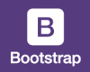

# Hola comunidad de ***GitHub***!!! :earth_africa:
## *Voy a compartir con ustedes algunos de mis secretos* :unlock:
##### *Me encanta la música en directo y los festivales* :raised_hands: 
##### *Ir al #gimnasio* :muscle: 
##### *Hacer rutas de #senderismo* :runner: 
##### *y por supuesto... 
### el #diseño* :art: *y el #código* :computer:

# ¿Qué estoy estudiando en el Bootcamp de Code Space?
                